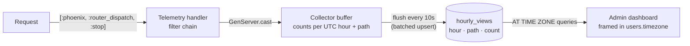

# View analytics: collection, storage, and timezones

How jamesnewton.com counts page views — server-side, aggregate-only, rendered
in the viewer's timezone. Companion to `docs/indexnow.md`; the design specs
live in `docs/superpowers/specs/2026-07-17-*-analytics-design.md`.

## The shape



Telemetry is the event bus, Postgres is the store, and the two decisions that
define the system are **what gets counted** (the filter chain) and **what a
"day" means** (hourly UTC buckets, converted at read time).

## What gets counted

The collector attaches to Phoenix's own `[:phoenix, :router_dispatch, :stop]`
event — controllers are never touched. A request counts only when ALL hold:

1. Route is one of the public pages: `/`, `/posts`, `/posts/:slug`,
   `/reading`, `/photos`, `/links`, `/resume`
2. `GET` with status `200`
3. No `?p=` preview token (shared draft links never count)
4. No authenticated session (the author's own browsing never counts)
5. User-agent is non-empty and doesn't match the bot heuristic
   (bot/crawler/spider/curl/wget/python/preview/…). "preview" is deliberate:
   link-unfurl fetchers (Discord, Slack) are not readers.

The handler runs in the request process, so it is pure pattern matching plus
one `GenServer.cast` — and it must never raise: `:telemetry` permanently
detaches a raising handler, which would silently stop all collection. Every
unexpected shape falls through to "don't count."

Path cardinality is bounded by construction: only allowlisted routes with 200s
are stored, and the stored value is `request_path` (query strings stripped), so
junk URLs and tokens can never mint rows.

## Why hourly UTC buckets

The table stores pre-aggregated counts, not events — `(hour, path, count)`,
one row per UTC hour per path, upserted with an atomic
`count = count + EXCLUDED.count`. Aggregation is lossy: whatever clock decides
a bucket at write time is baked in forever. Daily buckets forced that decision
(and UTC days mis-dayed all US-evening traffic: UTC midnight is 5pm Pacific).
Hourly buckets keep the storage aggregate and anonymous while making the day
decision **deferrable to read time**:

```sql
((hour AT TIME ZONE 'UTC') AT TIME ZONE $viewer_tz)::date
```

A "day" is computed per query in the viewer's zone — retroactively correct for
all history when the setting changes, and DST days (23/25 hours) come out right
by construction. Known approximation: zones with :30/:45 offsets (India,
Nepal) misalign day edges by up to 45 minutes against whole-hour buckets —
accepted as noise at this scale.

Every bucket-key producer (collector, seeds, tests) emits UTC DateTimes at
whole hours with zeroed minutes/seconds; the unique index on `(hour, path)`
backstops the upsert.

## The timezone setting

`users.timezone` (IANA name, validated with `Tzdata.zone_exists?/1`, default
`America/Los_Angeles`) is picked in admin Settings and drives everything the
dashboard renders: which day is "today," the Mon–Sun week frame, busiest-day
and per-day averages. It is deliberately settable only through the settings
action — no other changeset casts it.

Residual accepted risk: if a future tzdata update removes a stored zone,
`DateTime.now!/1` raises and the dashboard 500s — but `/admin/settings` does
not call it, so recovery is picking another zone. A rescue-to-default in
`Newton.Analytics.local_today/1` closes this if it ever bites.

## The flush cycle

Casts accumulate counts in the collector's in-memory map; every 10 seconds
(`flush_interval`, `:manual` in test so the Ecto sandbox stays deterministic)
the buffer is written as one batched upsert inside a
`[:newton, :analytics, :flush]` telemetry span. Failure semantics are
deliberate: a failed flush logs a warning and **drops the buffer** — no retry,
no growth, no crash loop. A crash or `kill -9` loses at most one 10-second
window; clean shutdown flushes in `terminate/2`. Analytics never blocks or
breaks a page view.

## Privacy

Nothing per-visitor is ever stored: no IPs, no sessions, no cookies, no user
agents (the UA string is examined in memory for the bot check and discarded).
The table holds `(hour, path, count)` and timestamps — there is nothing to
disclose, export, or consent-banner.

## Operations

- **Counts start at deploy.** Server-side history is unknowable; there is no
  backfill. The dashboard is zeros until real anonymous traffic arrives — the
  author's own logged-in visits don't move it, by design.
- **Bot heuristic is the watch item.** The UA regex meets real crawler traffic
  only in production; if counts look inflated after a few days, the heuristic
  is where to look.
- **Fake data:** `priv/repo/seeds.exs` writes 30 deterministic days of
  hour-keyed history (and wipes `hourly_views` first, because the upsert
  increments — reseeding would otherwise double counts). Dev-only; seeds never
  run in production.
- **Growth:** ≈24 rows per path per day — years of data is a small table. No
  pruning needed; no index on the conversion expression needed at this scale.
- **Metrics:** flush duration/result is a `Newton.Metrics` distribution,
  visible in LiveDashboard (dev) and Grafana (prod).
