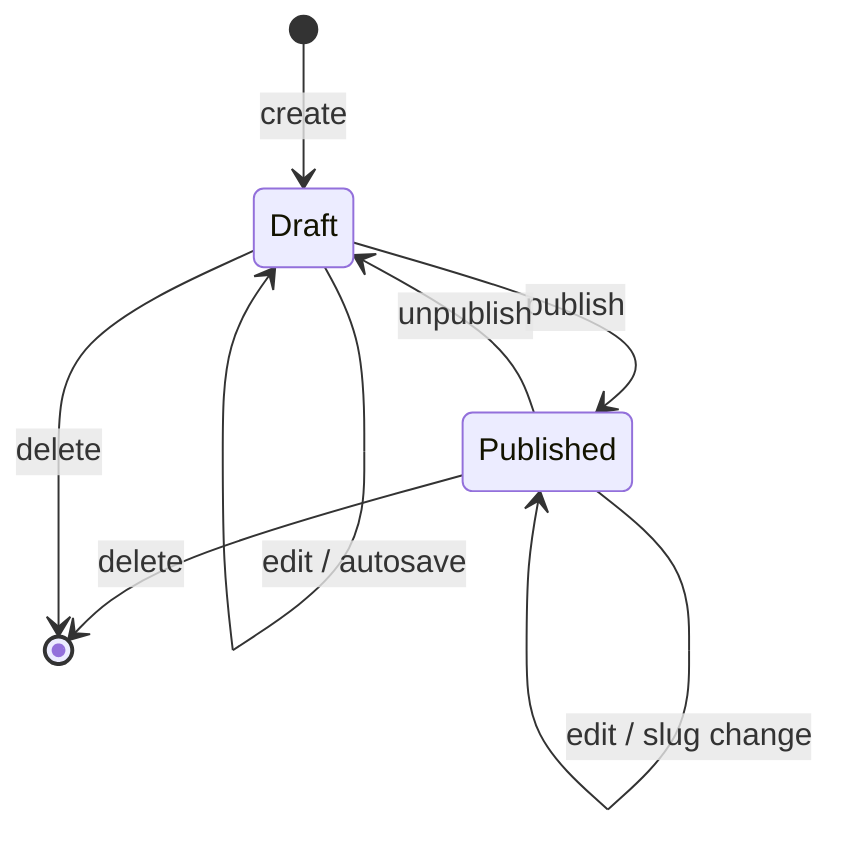

# Search indexing: sitemap, IndexNow, and the post lifecycle

How jamesnewton.com tells search engines about its content, and how a post's
lifecycle drives those notifications.

## The two mechanisms

**Sitemap (passive).** `GET /sitemap.xml` lists the public pages and every
published post with a `lastmod` date. Crawlers fetch it on their own schedule;
`lastmod` tells them what changed since last time. `GET /robots.txt` points at
it. This is the discovery path for **Google**, which does not participate in
IndexNow.

**IndexNow (active).** When a published post's public URLs change, we POST those
URLs to `api.indexnow.org` so participating engines (**Bing, Yandex, Seznam,
Naver**) recrawl promptly instead of waiting for their next sitemap poll.

Why both: the old "ping the engines with your sitemap URL" endpoints were
removed by Google (Jan 2024) and Bing, so active notification now means
IndexNow. Google is covered by the sitemap plus a one-time manual submission in
Search Console (see Operations).

## Architecture

The work is split across the domain and web layers along one line: **the web
layer decides *which* URLs changed; the domain layer *submits* them.**

| Module | Layer | Responsibility |
|---|---|---|
| `Newton.IndexNow` | domain | Transport. POSTs a list of URLs to the IndexNow API via Req. URL-agnostic. |
| `NewtonWeb.IndexNowNotifier` | web | Diffs a post's before/after state into the changed public URL set, then spawns the submission. |
| `NewtonWeb.SitemapController` | web | Renders `sitemap.xml` and `robots.txt`. |
| `Newton.Telemetry` | domain | Facade owning the `[:newton, …]` telemetry event prefix. |

`IndexNowNotifier` lives in the web layer because building a post's canonical
URL (`url(~p"/posts/#{slug}")`) requires the router and endpoint — domain
contexts must not reach up into web routing. `Newton.IndexNow` stays in the
domain layer precisely because it never touches routes; it takes URLs as data.

**Fire-and-forget.** Submissions run in a `Task.Supervisor` child
(`Newton.TaskSupervisor`), so a slow or failing IndexNow call can never block or
crash the admin editor. Every failure (non-2xx or transport error) becomes a
logged warning, not a raise.

**Config-gated.** `Newton.IndexNow` submits only when `enabled: true` — see
Configuration and enabling below.

**Telemetry.** Each submission is a `[:newton, :indexnow, :submit]` span.
Metadata is deliberately bounded — `result` (`:ok | :error`), HTTP `status`,
`url_count` — so it is safe as metric dimensions. The URLs themselves appear
only in log messages, never in telemetry (unbounded values would explode metric
cardinality).

## Configuration and enabling

Everything lives in `config/config.exs`; there is no secret and nothing to read
from the environment:

```elixir
config :newton, Newton.IndexNow,
  key: "d1258f1d59aea5c8f3e604eb494cc477",
  enabled: false
```

### What `enabled` gates

`enabled: true` turns on the outbound POST. When false, `submit/1` returns `:ok`
without an HTTP call, so `IndexNowNotifier` still computes the changed URL set
and runs end to end — nothing leaves the machine. That is the dev and test
posture, and it means the notifier's behaviour is exercised by tests without
network access.

The key file at `priv/static/<key>.txt` is served regardless of the flag, since
it is static content.

### Enabling

Flip `enabled: true` in `config/prod.exs` and deploy. There is no other step —
IndexNow has no registration, and ownership is proven by the key file already
being served from the host.

**Do this only once `jamesnewton.com` points at the app.** Submissions are built
from the endpoint's configured host, so enabling it while
`jamesnewton-com.fly.dev` is the live host would ask engines to crawl the
staging domain — the reason it stayed off through the migration.

## The key

IndexNow has no registration. The key is a self-generated hex string committed
as `priv/static/<key>.txt`; an engine verifies ownership by fetching that file
from our own host. It is public by design — committing it is safe. The same
literal appears in the key file, the app config, and the submission body.

To rotate: generate a new value (`openssl rand -hex 16`), replace it in all
three places, and remove the old key file.

## Post lifecycle → what gets submitted

A post is **published** when `published_at` is a `DateTime`, and a **draft**
when it is `nil`. Only published posts have public URLs, so only transitions
involving the published state submit anything.



`IndexNowNotifier.changed_urls(before, after)` computes the set. It collects the
public URL of the `before` post and the `after` post (each contributes its
`/posts/<slug>` URL only if published, nothing if draft), dedups them, and — if
any were collected — appends `/` and `/posts` because both render the published
feed.

| Transition | Submitted |
|---|---|
| create draft (`nil → draft`) | *nothing* |
| edit draft (`draft → draft`) | *nothing* |
| delete draft (`draft → nil`) | *nothing* |
| **publish** (`draft → published`) | post URL, `/`, `/posts` |
| create already-published (`nil → published`) | post URL, `/`, `/posts` |
| **edit published, same slug** | post URL, `/`, `/posts` |
| **rename published** (slug change) | old URL, new URL, `/`, `/posts` |
| **unpublish** (`published → draft`) | old URL, `/`, `/posts` |
| **delete published** | old URL, `/`, `/posts` |

`notify_change/2` is called at all seven post-mutation points in
`PostLive.Editor`, always with the pre-mutation post as `before` and the result
(or `nil` for delete) as `after`.

### Why autosave never submits

Autosave is **drafts-only**, guarded twice: the editor only schedules an
autosave timer while `published_at` is `nil`
(`track_save_state(_, _, published? = false)`), and `handle_info(:autosave, …)`
no-ops if the post is published. So `persist_autosave` only ever runs on drafts,
and a draft→draft transition yields an empty URL set. The autosave call sites
therefore call `notify_change` but always submit nothing — no risk of spamming
IndexNow with duplicate pings while editing.

### Preview tokens

A draft can carry a `preview_token` for sharing an unpublished post via a
token-gated URL. Preview posts are still drafts (`published_at` is `nil`), so
they contribute no URLs and are never submitted to IndexNow — correct, since
preview URLs should not be indexed.

## Operations

- **Google:** submit `https://jamesnewton.com/sitemap.xml` once in Google Search
  Console. Google polls a registered sitemap on its own schedule; resubmitting
  programmatically buys nothing, which is why there is no Search Console API
  integration here.
- **Verify the sitemap:** `curl https://jamesnewton.com/sitemap.xml` — published
  posts appear with a `lastmod`; drafts never do.
- **Verify IndexNow is live:** the key file must be reachable at
  `https://jamesnewton.com/<key>.txt`. Submissions show up in LiveDashboard as
  the `newton.indexnow.submit` metric, tagged by result.
- **Debugging a failed submission:** failures log a warning containing the URLs
  and the status/reason. A throttled key or a mismatched key file both surface
  as non-2xx responses.
